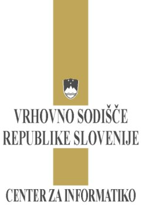
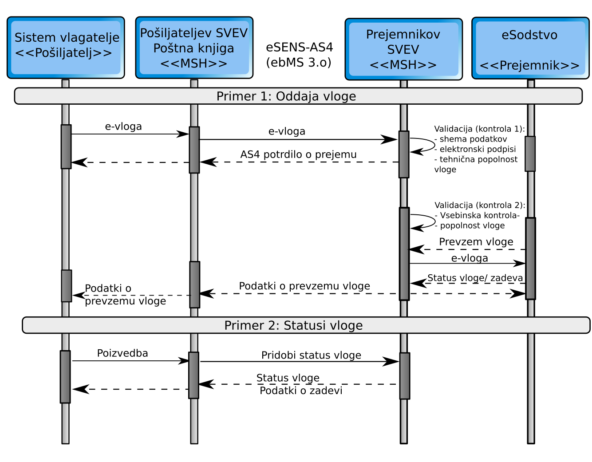

Funkcionalne in tehnične zahteve za 

e-Vlaganje v varni  
elektronski predal sodišča

Osnutek

Kontrola verzij

Zadnja verzija:

|                 |                |
| --------------- | -------------- |
| Verzija         | 0.1            |
| Datum           | 19\. 01. 2018  |
| Pripravil       |                |
| Odgovorna oseba |                |
| Zaupnost        | /              |
| Datoteka        |                |

Zgodovina:

|     |               |                |                   |
| --- | ------------- | -------------- | ----------------- |
| 0.1 | 19\. 01. 2018 | Jože Rihtaršič | Dokument kreiran. |
|     |               |                |                   |
|     |               |                |                   |
|     |               |                |                   |
|     |               |                |                   |
|     |               |                |                   |
|     |               |                |                   |
|     |               |                |                   |
|     |               |                |                   |

**Revizije:**

|  |  |  |  |
|  |  |  |  |
|  |  |  |  |

ZAŠČITA DOKUMENTA

<table>
<tbody>
<tr class="odd">
<td>
© 2014 - 2018 Vrhovno sodišče Republike Slovenije

Vse pravice pridržane. Reprodukcija po delih ali v celoti na kakršen koli način in na

katerem koli mediju ni dovoljena brez pisnega dovoljenja avtorja. Omejitve ne

veljajo za državne organe Republike Slovenije.

Vsaka kršitev se lahko preganja v skladu z Zakonom o avtorski in sorodnih pravicah

in Kazenskim zakonikom Republike Slovenije
</td>
</tr>
</tbody>
</table>

# Uvod

## Namen

Namen dokumenta je opisati tehnične zahteve in arhitekturo sistema za
elektronsko vlaganje ter postopek vlaganja v varne elektronske predale
sodišča. Izvedba elektronskega vlaganja temelji na standardu za
elektronsko vlaganje OASIC-ECF V4.x ter standardih, ki jih uporablja
Evropska komisija pri vzpostavitvi enotnega digitalnega trga Evrope . 

## Struktura dokumenta

V začetnem delu dokumenta sta kratka opisa namena uporabe standardov
OASIC-ECF V4.x in eSENS-AS4. Nato sledi opis postopka elektronskega
vlaganja. V zadnjem poglavju je opis tehničnega standarda za prenos
sporočil. 

# Uporaba odprto-kodnih standardov pri elektronskem vlaganju

Elektronska izmenjava podatkov med podjetji in organizacijami ni novost
v modernem poslovanju. Znano je, da elektronsko poslovanje prinaša mnogo
prednosti, vendar se manj govori o tem, da postaja vzdrževanje
integracij z naraščanjem števila e-storitev in števila partnerjev, s
katerimi poslujemo po elektronski poti, vedno večji strošek ter vedno
večji arhitekturni in produkcijski zalogaj. Vrhovno sodišče RS
pričakuje povečanje e-poslovanja sodišč z različnimi strankami, kot so:
odvetniki, tožilci, notarji, banke, zavarovalnice... Večino večjih
strank ima lastne informacijske sisteme, zato komunikacija preko
portalov ni tako učinkovita kot možnost neposredne integracije
informacijskih sistemov. 

Zato je eden od IT izzivov VSRS izbira primerne arhitekture, tehnologij
in standardov za e-poslovanje, ki bi omogočal dinamično
dodajanje/spreminjanje storitev ali partnerjev brez programiranja. Pri
tem je smiselno iskati rešitve, ki so splošno sprejete, cenovno dostopne
in preproste za uporabo. Poleg tega je smotrno upoštevati smernice
Evropske komisije, ki so se oblikovale pri vzpostavljanju enotnega
digitalnega trga Evrope. Za ta namen je bilo v preteklosti izdelanih kar
nekaj projektov, v katerih so sodelovali strokovnjaki, gospodarstveniki
in predstavniki javnega sektorja iz večjega števila članic EU. Cilj
projektov je bil izdelava infrastrukture za čezmejno elektronsko
poslovanje na področju javnega naročanja, zdravstva, javne uprave... Kot
najprimernejši standard za elektronsko izmenjavo podatkov in dokumentov
se je uveljavil standard OASIS ebMS 3.0 oz. njegov profil eSENS-AS4. 

## Standard OASIC-ECF V4.01 

Standard *OASIS LegalXML Electronic Court Filing* je nastal v
sodelovanju z javnim sektorjem in zasebnimi podjetji, kjer so upoštevane
tako zahteve vlagateljev kot tudi posebnosti in zahteve pri vlaganju na
sodišča. Standard določa tehnično arhitekturo, nabor komponent,
aktivnosti, pravila in strukture sporočil za elektronsko vlaganje na
sodišča. Zaradi lažjega prilagajanja implementacije tako tako sodiščem,
kot strankam sodišča, je sistem za elektronsko vlaganja razdeljen na
štiri glavne gradnike. 

  - **gradnik za sestavljanje e-vlog** (angl. Filing Assembly MDE):
    gradnik omogoča orodja, namenjena vlagatelju za sestavljanje,
    preverjanje in oddajo vloge na sodišče ter posredovanje obvestil
    ostalim strankam v zadevi. Omogoča tudi vpogled v odgovore sodišča
    ter orodja za poizvedovanje o zadevi, do katere ima uporabnik
    upravičenja. Gradnik je lahko del informacijskega sistema sodišča
    ali pa je izdelan zunaj njega; 
  - **gradnik za pregled e-vlog** (angl. Filing Review MDE): gradnik
    omogoča sodnemu osebju pregled, kontrolo in pripravo vloge na
    dokončen sprejem v informacijski sistem sodišča ali zavrnitev
    vloge. Gradnik vsebuje storitve za dostop do informacij, potrebnih
    za sestavljanje vlog: nabor elektronskih storitev, ki jih sodišče
    omogoča, metoda za izračun takse, metoda za oddajo vloge, ...; 
  - **gradnik za sprejem e-vloge** (angl. Filing Record MDE): gradnik
    omogoča dokončen sprejem vloge v elektronski IS sodišča, ter
    storitve, ki omogočajo stranki dostop do informacij o njenih zadevah
    na sodišču (koledar dogodkov v zadevi, pregled vloženih dokumentov
    in podobno) ter dostop do identifikatorjev elementov, ki so potrebni
    za sestavljanje vloge; 
  - **gradnik za e-vročanje** (angl. Legal Service MDE): gradnik omogoča
    pošiljanje sporočil ostalim strankam v postopkih.

Posamezni gradnik je lahko v sistemu za elektronskega vročanja izdelan v
več različicah ter se tako prilagaja raznovrstnosti (velikost, možnost
stopnja integracije, informacijska pismenost, itd. ) strank sodišča, ki
uporabljajo različne izvedbe gradnika za sestavljanje in pregled vlog: 

  - **ponudnik sistema za izdelavo eVlog:** komercialni ponudniki
    sistema za e-vlaganje tržijo orodja za izdelavo eVlog in njihovo
    vlaganje na sodišče; 
  - **lastna rešitev:** sodišč lahko kupi ali izdela lastni sistem za
    e-vlaganje, kot je na primer portal za eVlaganje; 

<!-- end list -->

  - **rešitev „po meri“**: stranke sodišča nadgradijo lastne IS za
    sestavljanje in vlaganje eVlog na sodišče. 

## Standard eSENS-AS4

Standard ebMS 3.0 predpisuje komunikacijsko nevtralen mehanizem, ki
temelji na SOAP sporočilih in rešuje tehnična vprašanja glede
naslavljanja, varnosti, zanesljivosti prenosa, preverjanja avtentičnosti
sporočil itd. Osnovni koncept komunikacije oziroma vročanja temelji na
implementaciji transportnega modula, t. im. »Messaging Service Handler«
(v nadaljevanju MSH). Par MSH modulov izvaja transport sporočil med
prejemnikom in naslovnikom na varen in zanesljiv način.

Standard predpisuje nabor parametrov, to so t. im. P-Mode parametri
(angl. *Processing Mode*), s katerimi lahko določamo nivo in parametre
varnosti in zanesljivosti transporta med MSH moduli, ter način
naslavljanja in preverjanja tipov priponk v sporočilu. Parametri
omogočajo izdelavo univerzalnega MSH modula za izdelavo novih
integracij in poslovnih koreografij izmenjave sporočil brez poseganja v
programsko kodo MSH modula. Parametri P-Mode so razporejeni v šest
vsebinsko povezanih kategorij:

  - **splošni parametri**, kot so enolična oznaka konfiguracije,
    referenca na pogodbo za izmenjavo dokumentov, identifikator
    naslovnika/prejemnika sporočila ter vloge pri izmenjavi dokumentov; 
  - **protokol**: določa spodaj ležeči protokol izmenjave (HTTP, SMTP,
    FTP) ter naslov (URL ali email) prejemnikovega MSH;
  - **poslovni kontekst**: določa namen, storitev, akcijo in obliko
    vsebine;
  - **napake**: razdelek določa ravnanje in poročanje v primeru napak
    pri prenosu;
  - **zanesljivost prenosa**: parametri določajo uporabo mehanizmov za
    zagotavljanje zanesljivosti prenosa;
  - **varnost**: parametri določajo nivo varnosti, pravila in
    certifikate za enkripcijo in podpisovanje sporočil.

Z ciljem izdelave enotnega digitalnega trga Evrope se je oblikoval
profil uporabe standarda ebMS 3.0 za prenos sporočil: eSENS-AS4, ki je
upoštevan v tehničnih specifikacijah elektronskega vlaganja. 

## Vsebine elektronskega vlaganja

Trenutno se v elektronski obliki vročajo predvsem vsebine v PDF obliki,
ki so namenjene ročni interpretaciji in obdelavi. S povečevanjem
avtomatizacije poslovnih procesov, tako na strani sodišča kot pri
strankah, lahko zagotovo pričakujemo, da se bo struktura podatkov
spreminjala, tako da bodo podatki primernejši za strojno obdelavo. 

# Elektronsko vlaganje

## Oddaja vloge

Pošiljatelj sestavi vlogo ter jo preko lastnega varnega elektronskega
predala posreduje v varni elektronski predal sodišča. Ob prejemu vloge
na sodišče se preveri tehnična ustreznost pošiljke. V posameznih
postopkih, kjer je predpisana strukturirana oblika podatkov se preveri
tudi veljavnost posameznih podatkov v vlogi.  V primeru, da je vloga
tehnično neustrezna je odgovor napaka, sicer se vrne AS4 potrdilo o
prejemu. 

## Vpis vloge na zadevo

Pred vpisnim vloge v vpisnik se izvedejo dodatne kontrole. Po vpisu
informacijski sistem vrne status vpisa (čas in datum vpisa, opravilno
številko zadeve, šifro sodišča) v sistem pošiljatelja pošiljke.

## Statusi vloge

Pošiljatelj lahko s posebnim sporočilom preverja status oddane vloge. V
odgovoru se vrnejo vsi dogodki vloge (dogodek, čas in datum dogodka ,
opravilno številko zadeve, šifro sodišča) za posamezno vlogo. Dogodki na
vlogi so: Sprejem vloge na sodišče, Kontrola podatkov na vlogi in vnos
vloge na zadevo.

# Tehnična izvedba e-vlaganja 

Prenos elektronskih sporočil med modulom e-poštna knjiga in sistemom za
varno elektronsko vročanje poteka po standardu (OASIS) ebMS 3.0. Pred
nadaljevanjem je potrebno razumevanje specifikacije 

ebMS 3.0
(<http://docs.oasis-open.org/ebxml-msg/ebms/v3.0/core/ebms_core-3.0-spec.html>)
in AS4
(<http://docs.oasis-open.org/ebxml-msg/ebms/v3.0/profiles/AS4-profile/v1.0/AS4-profile-v1.0.html>).

V nadaljevanju je opisana konfiguracijo P-Mode, ki je uporabljena za
namene e-vlaganja.

<table>
<tbody>
<tr class="odd">
<td>Transportni standardi</td>
<td>
Prenos sporočil poteka preko TLS seje, ki se vzpostavi z obojestransko avtentikacijo (Mutual authentication). 

TLS + HTTP 1.1 + SOAP 1.2 + WSS 1.1 + SOAP with Attachments
</td>
</tr>
<tr class="even">
<td>EbMS 3.0 MEP </td>
<td>One-way / Push</td>
</tr>
<tr class="odd">
<td>Zanesljivost:</td>
<td>
Prejemnik sporočil kot odgovor vrača AS4Receipt ali Exception signal. V primeru SoapFault ali tcp/http ERROR, pošilatelj sporočilo poskuša ponovno poslati, tako kot to določajo »Retry« nastavitve. V primeru neuspešnega pošiljanja pošiljateljev MSH vrne pošiljatelju opozorilo o neposlani pošiljki. Prejemnikov MSH mora zaznavati »dvojnike« sporočil in jih eliminirati/ignorirati. 

Nastavitve <strong>PMode</strong>: 

Vsi »PUSH« klici servisov imajo v odgovoru podpisano potrdilom o prejemu AS4Receipt.

PMode[1].ReceptionAwareness: true

PMode[1].Security.SendReceipt: true;

Pmode[1].Security.SendReceipt.ReplyPattern: response

V primeru neuspešnega pošiljanja, pošiljatelj poskuša ponovno poslati izvorno sporočilo.

PMode[1].ReceptionAwareness.Retry: true;

Spodnja nastavitev ponovnega pošiljanja služi le kot primer – nastavitve so odvisne od funkcionalnosti aplikacije. 

<strong>PMode[1].ReceptionAwareness.Retry.Parameters: maxretries=5, period=2000, e</strong><em><em><strong>xponentialBackoff=true;</strong></em></em><strong> </strong>

Prejemnikov MSH mora izločiti vse podvojene pošiljke. Podvojena pošiljka se zaznava na podlagi podatka: <strong>eb:MessageInfo/eb:MessageId.</strong><em> </em>

Odgovor na »podvojeno pošiljko je« AS4Receipt dodatnim <em><strong>eb:SignalMessage/eb:Error</strong></em> z vrednostmi:

Primer;

&lt;eb:Error origin="reliability" category="delivery" errorCode="SVEV:0201" severity="warning" refToMessageInError="UUID-23@sender.ebox.si" shortDescription="First sucessfuly delivery: 2014-07-25T12:19:05"&gt; 

&lt;/eb:Error&gt;

PMode[1].ReceptionAwareness.DuplicateDetection: true;

Podvojena pošiljka detekcija zaznava za obdobje 5 let (obdobje veljavnosti podpisa pošiljke)

PMode[1].ReceptionAwareness.DetectDuplicates.Parameters: 5y

Minimalna velikost sporočila, ki ga sistem mora sprejeti je najmanj 10MB. Propustnost programske opreme mora zagotavljati zaporedni sprejem (z odgovorom) vsaj treh e-pošiljk (v velikosti 100kB) v eni sekundi. 
</td>
</tr>
<tr class="even">
<td>Varnost</td>
<td>
Vsa sporočila morajo biti podpisana s pošiljateljevim spletnim certifikatom. 

PMode[1].Security.X509.Sign: true

Podpisani so elementi: env:Header/eb3:Messaging in env:Body ter vse SOAP priponke. 

eb3: http://docs.oasis-open.org/ebxml-msg/ebms/v3.0/ns/core/200704/"/&gt; 

soap: namespace="http://www.w3.org/2003/05/soap-envelope"/&gt;

Lastnosti podpisa sporočila: 

PMode[1].Security.X509.Signature.HashFunction: 

http://www.w3.org/2001/04/xmlenc#sha256

PMode[1].Security.X509.Signature.Algorithm:http://www.w3.org/2001/04/xmldsig-more#rsa-sha256
</td>
</tr>
<tr class="odd">
<td>Oznaka pošiljatelja in prejemnika</td>
<td>
Pošiljateljev in naslovnikov predal se označuje z e-predalom, ki je sestavljen iz

[lokalni naziv]@[pod domena].[domena ponudnika predala]

Primeri:

lokalni naziv: odv.janez (obvezen podatek)

poddomena: druzba.si (neobvezen podatek)

domena podnudnika e-predala, ki vroča: ebox.si, (obvezen podatek)

Primer : <a href="mailto:odv.janez@druzba.si.ebox.si">odv.janez@druzba.si.ebox.si</a>

V primeru da poddomena ni podana je naslov:

<a href="mailto:odv.janez@ebox.si">odv.janez@ebox.si</a>

Lokalni naziv je lahko do 64 znakov, domena vročevalca skupaj z poddomeno pa do največ 255 znakov. (Glej: RFC5322)

Poleg predala je obvezen tudi naziv pošiljatelja in prejemnika. 

Podatka predal in naziv se označuje s tipom: 

<strong>urn:oasis:names:tc:ebcore:partyid-type:unregistered:</strong><strong>si-svev:e-box </strong>za e-predal in 

urn:oasis:names:tc:ebcore:partyid-type:unregistered:si-svev:name za naziv.

Primer: 

&lt;ns2:To&gt;

 &lt;ns2:PartyId type="urn:oasis:names:tc:ebcore:partyid-type:unregistered:si-svev:name"&gt;Srečko Prejemnik&lt;/ns2:PartyId&gt;

 &lt;ns2:PartyId type="urn:oasis:names:tc:ebcore:partyid-type:unregistered:si-svev:e-box"&gt;srecko.prejemnik@e-box-a.si   
   &lt;/ns2:PartyId&gt;

   &lt;ns2:Role&gt;si-svev:receiver&lt;/ns2:Role&gt; 
&lt;/ns2:To&gt;
</td>
</tr>
<tr class="even">
<td>Servisi in akcije</td>
<td>
Način vročanja ter posamezno fazo vročanja označujeta podatka v 

<strong>eb:UserMessage/eb:CollaborationInfo/eb:Service</strong> 

in 

<strong>eb:UserMessage/eb:CollaborationInfo/eb:Action</strong> 

V primeru, da je vročanje koreografija izmenjave več sporočil, jih povezuje podatek: <strong>eb:UserMessage/eb:CollaborationInfo/eb:ConversationId</strong><em>.</em>

Sporočila, ki pripadajo postopku oddaje vlog imajo v elementu <strong>eb:UserMessage/eb:CollaborationInfo/eb:Service </strong>vrednost: 

V elementu: <strong>eb:UserMessage/eb:CollaborationInfo/eb:Action</strong> so lahko naslednje vrednosti: 
- <strong>ServeFiling: </strong>Oddaja vloge na sodišče,<strong> 
-</strong> <strong>NotifyFilingReviewComplete: </strong>Vročilnica,<strong> 
</strong>

Primer: 

&lt;eb:CollaborationInfo&gt;

   &lt;eb:AgreementRef pmode="legal-delivery:e-box-a.si"&gt;e-box-a.si:e-box-b.si&lt;/eb:AgreementRef&gt;

    &lt;eb:Service&gt;<strong>CourtFiling</strong>&lt;/eb:Service&gt;

    &lt;eb:Action&gt;<strong>ServeFiling</strong>&lt;/eb:Action&gt;

    &lt;eb:ConversationId&gt;575e09ca-e49f-4ed8-8718-759fe993b4b9&lt;/eb:ConversationId&gt;

&lt;/eb:CollaborationInfo&gt;
</td>
</tr>
<tr class="odd">
<td>Prenos vsebin</td>
<td>
Posamezne vsebine se v SOAP sporočilo dodajo na način kot to določa standarda »SOAP with attachment«

------=_Part_1_1083973693.1428143691672

Content-Type: application/soap+xml; charset=utf-8

&lt;soap:Envelope xmlns:soap="http://www.w3.org/2003/05/soap-envelope/"

xmlns:eb="http://docs.oasis-open.org/ebxml-msg/ebms/v3.0/ns/core/200704/"&gt;

    &lt;soap:Header&gt;

...

        &lt;eb:Messaging S11:mustUnderstand="1"&gt;

...

            &lt;ns3:PayloadInfo&gt;

               &lt;ns3:PartInfo href="cid:42eb013c-0606-4d6b-a84f-d71590d2e758@ebox.test.si"/&gt;

            &lt;/ns3:PayloadInfo&gt;

        &lt;/eb:Messaging&gt;

    &lt;/soap:Header&gt;

    &lt;soap:Body /&gt;

  &lt;/soap:Envelope&gt;

------=_Part_1_1083973693.1428143691672

Content-Type: application/pdf

Content-ID: &lt;42eb013c-0606-4d6b-a84f-d71590d2e758@ebox.test.si&gt;

Content-Transfer-Encoding: binary

id: 42eb013c-0606-4d6b-a84f-d71590d2e758@ebox.test.si 

�PDF 1.4

#

###

IHDR###

...
</td>
</tr>
<tr class="even">
<td>Metapodatki sporočila:</td>
<td>
Zaradi lažjega avtomatskega usmerjanja dohodnih pošiljk na strani naslovnika imajo pošiljke pošiljke poslane iz sodišča naslednje parametre, za sporočila posredovana v informacijski sistem sodišča parametri niso obvezni.
</td>
</tr>
<tr class="odd">
<td>Metapodatki vsebin / priponk</td>
<td>
Poleg metapodatkov, ki jo določa standard AS4 za priponke dodatno vsebujejo naslednje metapodatke:

Name
</td>
</tr>
</tbody>
</table>

# Tabele in šifranti

## Šifrant sodišč

Opomba: Najnovejši šifrant je objavljen na spletnih straneh sodišča:
www.sodisce.si

|       |                                                                      |                                       |             |                    |
| ----- | -------------------------------------------------------------------- | ------------------------------------- | ----------- | ------------------ |
| Šifra | Naziv                                                                | Naslov                                | Pošt. štev. | Kraj               |
| S01   | Vrhovno sodišče RS                                                   | Tavčarjeva 9                          | 1000        | Ljubljana          |
| S02   | Višje sodišče v Ljubljani                                            | Tavčarjeva 9                          | 1000        | Ljubljana          |
| S03   | Okrožno sodišče v Ljubljani                                          | Tavčarjeva 9                          | 1000        | Ljubljana          |
| S04   | Okrožno sodišče v Mariboru                                           | Sodna ulica 14                        | 2000        | Maribor            |
| S05   | Okrožno sodišče v Murski Soboti                                      | Slomškova 21                          | 9000        | Murska Sobota      |
| S06   | Okrožno sodišče v Novi Gorici                                        | Kidričeva 14                          | 5000        | Nova Gorica        |
| S07   | Okrožno sodišče v Novem mestu                                        | Jerebova 2                            | 8000        | Novo mesto         |
| S08   | Okrožno sodišče v Celju                                              | Prešernova 22                         | 3000        | Celje              |
| S09   | Okrožno sodišče v Kopru                                              | Ferrarska 9                           | 6000        | Koper              |
| S10   | Okrožno sodišče v Kranju                                             | Zoisova 2                             | 4000        | Kranj              |
| S11   | Okrožno sodišče v Krškem                                             | Cesta krških žrtev 12                 | 8270        | Krško              |
| S12   | Okrožno sodišče na Ptuju                                             | Krempljeva 7                          | 2250        | Ptuj               |
| S13   | Okrožno sodišče v Slovenj Gradcu                                     | Kidričeva 1                           | 2380        | Slovenj Gradec     |
| S20   | Okrajno sod. v Ljubljani - centralni oddelek za verodostojno listino | Kersnikova 2                          | 1000        | Ljubljana          |
| S23   | Okrajno sodišče v Ljubljani                                          | Miklošičeva 10                        | 1000        | Ljubljana          |
| S24   | Okrajno sodišče v Mariboru                                           | Cafova 1                              | 2508        | Maribor            |
| S25   | Okrajno sodišče v Murski Soboti                                      | Slomškova 21                          | 9000        | Murska Sobota      |
| S26   | Okrajno sodišče v Novi Gorici                                        | Prvomajska 50                         | 5000        | Nova Gorica        |
| S27   | Okrajno sodišče v Novem mestu                                        | Jerebova 2                            | 8000        | Novo mesto         |
| S28   | Okrajno sodišče v Celju                                              | Prešernova 22                         | 3000        | Celje              |
| S29   | Okrajno sodišče v Kopru                                              | Ferrarska 9                           | 6000        | Koper              |
| S30   | Okrajno sodišče v Kranju                                             | Zoisova 2                             | 4000        | Kranj              |
| S31   | Okrajno sodišče v Krškem                                             | Cesta krških žrtev 12                 | 8270        | Krško              |
| S32   | Okrajno sodišče na Ptuju                                             | Vodnikova 2                           | 2250        | Ptuj               |
| S33   | Okrajno sodišče v Slovenj Gradcu                                     | Kidričeva 1                           | 2380        | Slovenj Gradec     |
| S41   | Okrajno sodišče v Ajdovščini                                         | Gregorčičeva 28                       | 5270        | Ajdovščina         |
| S42   | Okrajno sodišče v Brežicah                                           | Cesta prvih borcev 48                 | 8250        | Brežice            |
| S43   | Okrajno sodišče v Cerknici                                           | Cesta 4. maja 23                      | 1380        | Cerknica           |
| S44   | Okrajno sodišče v Črnomlju                                           | Trg svobode 1                         | 8340        | Črnomelj           |
| S45   | Okrajno sodišče v Domžalah                                           | Ljubljanska 76                        | 1230        | Domžale            |
| S46   | Okrajno sodišče v Gornji Radgoni                                     | Kerenčičeva 3                         | 9250        | Gornja Radgona     |
| S47   | Okrajno sodišče v Grosupljem                                         | Adamičeva 6                           | 1290        | Grosuplje          |
| S48   | Okrajno sodišče v Ilirski Bistrici                                   | Bazoviška 22                          | 6250        | Ilirska Bistrica   |
| S49   | Okrajno sodišče v Idriji                                             | Mestni trg 1                          | 5280        | Idrija             |
| S50   | Okrajno sodišče na Jesenicah                                         | Titova 37                             | 4270        | Jesenice           |
| S51   | Okrajno sodišče v Kamniku                                            | Glavni trg 22                         | 1241        | Kamnik             |
| S52   | Okrajno sodišče v Kočevju                                            | Ljubljanska 26                        | 1330        | Kočevje            |
| S53   | Okrajno sodišče v Lenartu                                            | Jurovska cesta 15                     | 2230        | Lenart             |
| S54   | Okrajno sodišče v Lendavi                                            | Glavna ulica 9                        | 9220        | Lendava            |
| S55   | Okrajno sodišče v Litiji                                             | Jerebova 6                            | 1270        | Litija             |
| S56   | Okrajno sodišče v Ljutomeru                                          | Prešernova 18                         | 9240        | Ljutomer           |
| S57   | Okrajno sodišče v Ormožu                                             | Ptujska cesta 8c                      | 2270        | Ormož              |
| S58   | Okrajno sodišče v Piranu                                             | Tartinijev trg 1                      | 6330        | Piran              |
| S59   | Okrajno sodišče v Postojni                                           | Jenkova 3                             | 6230        | Postojna           |
| S60   | Okrajno sodišče v Radovljici                                         | Gorenjska c. 15                       | 4240        | Radovljica         |
| S61   | Okrajno sodišče v Sevnici                                            | Glavni trg 30                         | 8290        | Sevnica            |
| S62   | Okrajno sodišče v Sežani                                             | Kosovelova 1                          | 6210        | Sežana             |
| S63   | Okrajno sodišče v Slovenski Bistrici                                 | Kolodvorska 10                        | 2310        | Slovenska Bistrica |
| S64   | Okrajno sodišče v Slovenskih Konjicah                                | Mestni trg 6                          | 3210        | Slovenske Konjice  |
| S65   | Okrajno sodišče v Šentjurju                                          | Dušana Kvedra 45                      | 3230        | Šentjur            |
| S66   | Okrajno sodišče v Škofji Loki                                        | Partizanska cesta 1a                  | 4220        | Škofja Loka        |
| S67   | Okrajno sodišče v Šmarju pri Jelšah                                  | Aškerčev trg 11                       | 3240        | Šmarje pri Jelšah  |
| S68   | Okrajno sodišče v Tolminu                                            | Mestni trg 1                          | 5220        | Tolmin             |
| S69   | Okrajno sodišče v Trbovljah                                          | Trg revolucije 11                     | 1420        | Trbovlje           |
| S70   | Okrajno sodišče v Trebnjem                                           | Gubčeva cesta 9                       | 8210        | Trebnje            |
| S71   | Okrajno sodišče v Velenju                                            | Prešernova 1                          | 3320        | Velenje            |
| S72   | Okrajno sodišče na Vrhniki                                           | Cankarjev trg 8                       | 1360        | Vrhnika            |
| S73   | Okrajno sodišče v Žalcu                                              | Levstikova 14                         | 3310        | Žalec              |
| S74   | Upravno sodišče Republike Slovenije                                  | Fajfarjeva 33                         | 1000        | Ljubljana          |
| S75   | Upravno sodišče Republike Slovenije - Zunanji oddelek v Mariboru     | Ulica škofa Maksimilijana Držečnika 6 | 2000        | Maribor            |
| S76   | Upravno sodišče Republike Slovenije - Zunanji oddelek v Novi Gorici  | Rejčeva ulica 7                       | 5000        | Nova Gorica        |
| S77   | Upravno sodišče Republike Slovenije - Zunanji oddelek v Celju        | Trg celjskih knezov 10                | 3000        | Celje              |
| S81   | Delovno sodišče v Celju                                              | Gregorčičeva 6                        | 3000        | Celje              |
| S82   | Delovno sodišče v Kopru                                              | Ferrarska 9                           | 6000        | Koper              |
| S83   | Delovno in socialno sodišče v Ljubljani                              | Resljeva 14                           | 1000        | Ljubljana          |
| S84   | Delovno sodišče v Mariboru                                           | Glavni trg 17                         | 2000        | Maribor            |
| S85   | Delovno sodišče v Kopru - Zunanji oddelek v Novi Gorici              | Kidričeva 14                          | 5000        | Nova Gorica        |
| S86   | Delovno sodišče v Kopru - Zunanji oddelek v Postojni                 | Jenkova 3                             | 6230        | Postojna           |
| S87   | Delovno in socialno sodišče v Ljubljani - Zunanji oddelek v Brežicah | Cesta prvih borcev 48                 | 8250        | Brežice            |
| S88   | Delovno in socialno sodišče v Ljubljani - Zunanji oddelek v Kranju   | Zoisova 2                             | 4000        | Kranj              |
| S89   | Delovno in socialno sodišče v Ljubljani - Zunanji odd. v Novem mestu | Jerebova 2                            | 8000        | Novo mesto         |
| S90   | Delovno sodišče v Mariboru - Zunanji oddelek v Murski Soboti         | Slomškova 21                          | 9000        | Murska Sobota      |
| S91   | Delovno sodišče v Mariboru - Zunanji oddelek v Slovenj Gradcu        | Kidričeva 1                           | 2380        | Slovenj Gradec     |
| S92   | Delovno sodišče v Mariboru - Zunanji oddelek na Ptuju                | Krempljeva 7                          | 2250        | Ptuj               |
| S93   | Višje delovno in socialno sodišče                                    | Dunajska 22                           | 1000        | Ljubljana          |
| S94   | Višje sodišče v Mariboru                                             | Sodna ulica 14                        | 2000        | Maribor            |
| S95   | Višje sodišče v Celju                                                | Prešernova 22                         | 3000        | Celje              |
| S96   | Višje sodišče v Kopru                                                | Ferrarska 9                           | 6000        | Koper              |
| S97   | Delovno in socialno sodišče v Ljubljani - Socialni oddelek           | Komenskega 7                          | 1000        | Ljubljana          |

## Šifrant informacijskih sistemov sodišča, ki uporabljajo elektronsko vročanje

Opomba: Najnovejši šifrant je objavljen na spletnih straneh sodišča:
www.sodisce.si

|       |                |                                                          |
| ----- | -------------- | -------------------------------------------------------- |
| Šifra | Naziv vpisnika | Opis                                                     |
| ZKVP  | eZK-vpisnik    | Informacijski sistem za vodenje zemljiško knjižnih zadev |
| INSVP | eINS-vpisnik   | Informacijski sistem za vodenje insolventnih postopkov   |
| IVPN  | I-vpisnik      | Informacijski sistem za vodenje izvršilnih postopkov     |

## Šifrant vpisnikov, ki uporabljajo elektronsko vročanje

Opomba: Najnovejši šifrant je objavljen na spletnih straneh sodišča:
www.sodisce.si

|         |                 |                         |                               |
| ------- | --------------- | ----------------------- | ----------------------------- |
| Vpisnik | Vpisnik kratica | Opis                    | Šifra informacijskega sistema |
| 04      | Z               | Izvršba-Zavarovanja     | IVPN                          |
| 03      | In              | Izvršba-na nepremičnino | IVPN                          |
| 02      | Ig              | Izvršba-gospodarska     | IVPN                          |
| 01      | I               | Izvršba-civilna         | IVPN                          |
| 05      | R               | Izvršba-Razno           | IVPN                          |
| 00      | VL              | Izvršba-verodost.list.  | IVPN                          |

## Šifrant napak

Za prenos sporočil se uporablja shema in zapis napak, kot jih predvideva
standard ebMS 3.0
(<http://docs.oasis-open.org/ebxml-msg/ebms/v3.0/core/ebms_core-3.0-spec.html>;
glej razdelek: 6 Packaging of ebMS Errors in ) in profil AS4
(<http://docs.oasis-open.org/ebxml-msg/ebms/v3.0/profiles/AS4-profile/v1.0/os/AS4-profile-v1.0-os.html>;
glej razdelek: 3.6 Additional Features Errors).

|              |                               |                       |                    |                                                         |
| ------------ | ----------------------------- | --------------------- | ------------------ | ------------------------------------------------------- |
| Šifra napake | Kratek opis                   | Tip napake (Severity) | Katergorija napake | Opis                                                    |
| SVEV:0201    | IgnoredAlreadyReceivedMessage | warning               | delivery           | Opozorilo o prejemi pošiljke, z datumom prvega prejema. |
| SVEV:0202    | ReceiverNotExists             | failure               | content            | Naslovnik ne obstaja                                    |
