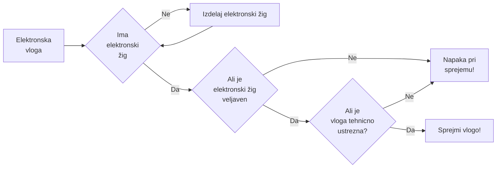

Urejanje diagramov
Navodila: https://mermaid-js.github.io/mermaid/#/flowchart
Editor: https://mermaid.live/

Elektronsko vlaganje



</details>
<!-- generated by mermaid compile action - END -->

</details>
<!-- generated by mermaid compile action - END -->

Goal: comment out the above, insert image ref

<!-- generated by mermaid compile action - START -->

<details>
  <summary>Mermaid markup</summary>

```mermaid
graph TD;
    A-->B;
    A-->C;
    B-->D;
    C-->D;
    W-->D;
    E-->Z;
