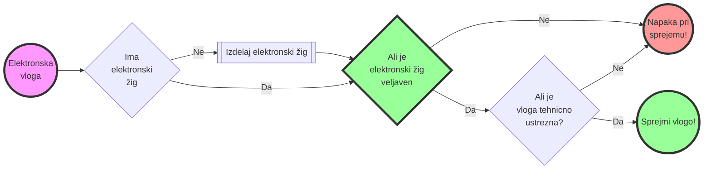
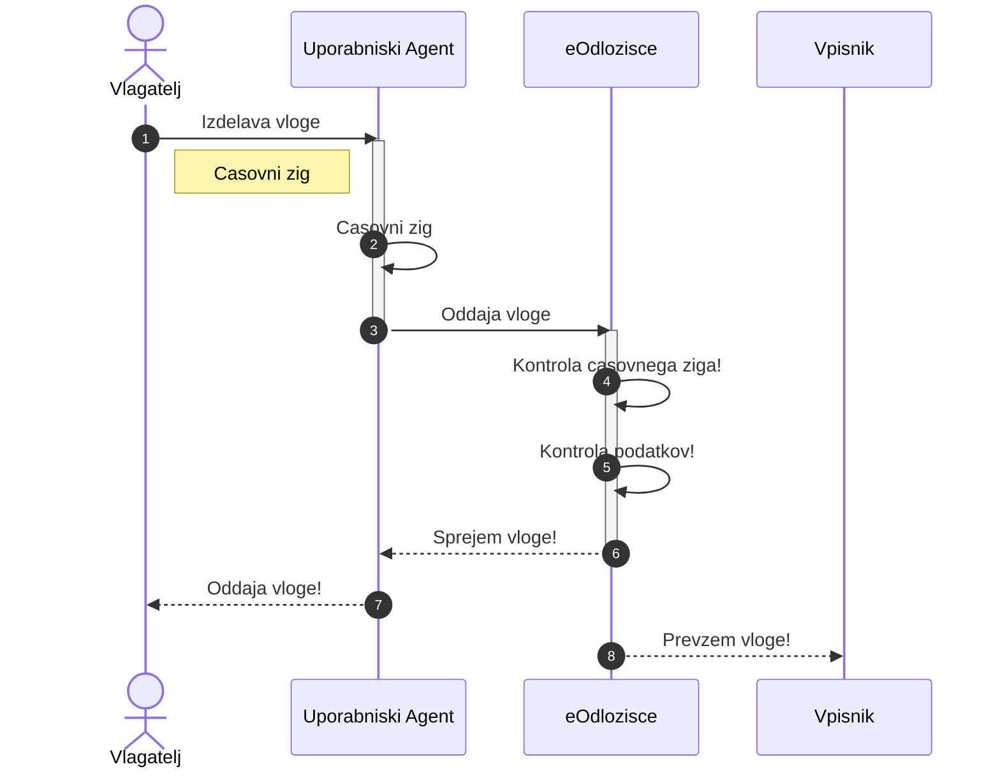

Urejanje diagramov
Navodila: https://mermaid-js.github.io/mermaid/#/flowchart
Editor: https://mermaid.live/

Elektronsko vlaganje

```mermaid
flowchart LR
style START fill:#f9f,stroke:#333,stroke-width:4px
style ERR fill:#f99,stroke:#333,stroke-width:4px
style REC fill:#9f9,stroke:#333,stroke-width:4px
style E font:10px,fill:#9f9,stroke:#333,stroke-width:4px
    START((Elektronska\nvloga)) --> B{Ima\nelektronski\nžig}
    B -->|Ne| ZIG[[Izdelaj elektronski žig]]
    ZIG --> E
    B -->|Da| E{Ali je\nelektronski žig\nveljaven}
    E -->|Da| F{Ali je\nvloga tehnicno\nustrezna?}    
    E -->|Ne| ERR((Napaka pri\nsprejemu!))
    F -->|Ne| ERR((Napaka pri\nsprejemu!))
    F -->|Da| REC((Sprejmi vlogo!))
```

```mermaid
sequenceDiagram
    autonumber
    actor VLG as Vlagatelj
    participant UA as Uporabniski Agent
    participant ODL as eOdlozisce
    participant VPN as Vpisnik

    VLG->>UA: Izdelava vloge
    activate UA
    Note right of VLG: Casovni zig 
    UA->>UA: Casovni zig
    UA->>ODL: Oddaja vloge
    deactivate UA
    activate ODL
    ODL->>ODL: Kontrola casovnega ziga!
    ODL->>ODL: Kontrola podatkov!
    ODL-->>UA: Sprejem vloge!
    deactivate ODL
    UA-->>VLG: Oddaja vloge!
    ODL-->>VPN: Prevzem vloge!
```    
