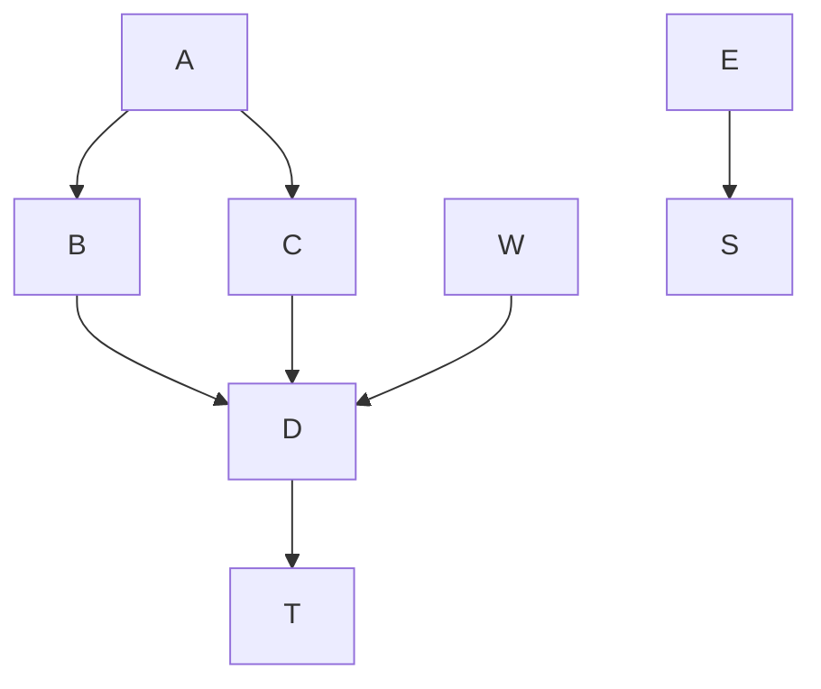

# Test this out

Here is an inline mermaid file

<!-- generated by mermaid compile action - START -->

<details>
  <summary>Mermaid markup</summary>



</details>
<!-- generated by mermaid compile action - END -->

Goal: comment out the above, insert image ref

<!-- generated by mermaid compile action - START -->

<details>
  <summary>Mermaid markup</summary>

```mermaid
graph TD;
    A-->B;
    A-->C;
    B-->D;
    C-->D;
    W-->D;
    E-->Z;
