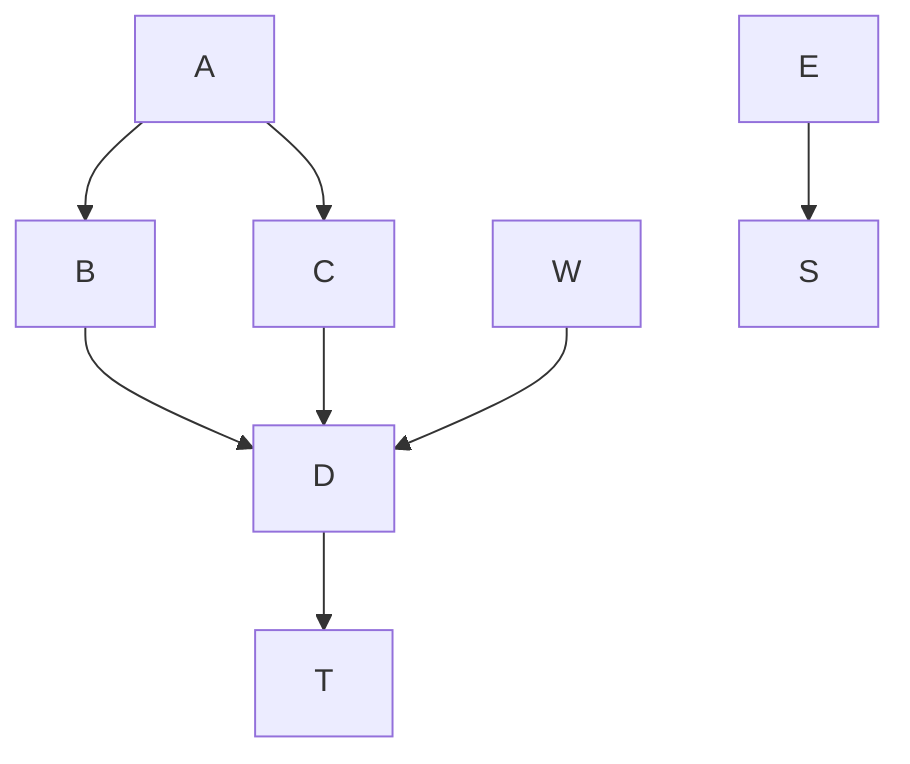

# Test this out

Here is an inline mermaid file
<!-- generated by mermaid compile action - START -->



</details>
<!-- generated by mermaid compile action - END -->

</details>
<!-- generated by mermaid compile action - END -->

Goal: comment out the above, insert image ref

```mermaid
graph TD;
    A-->B;
    A-->C;
    B-->D;
    C-->D;
    W-->D;
    E-->Z;
