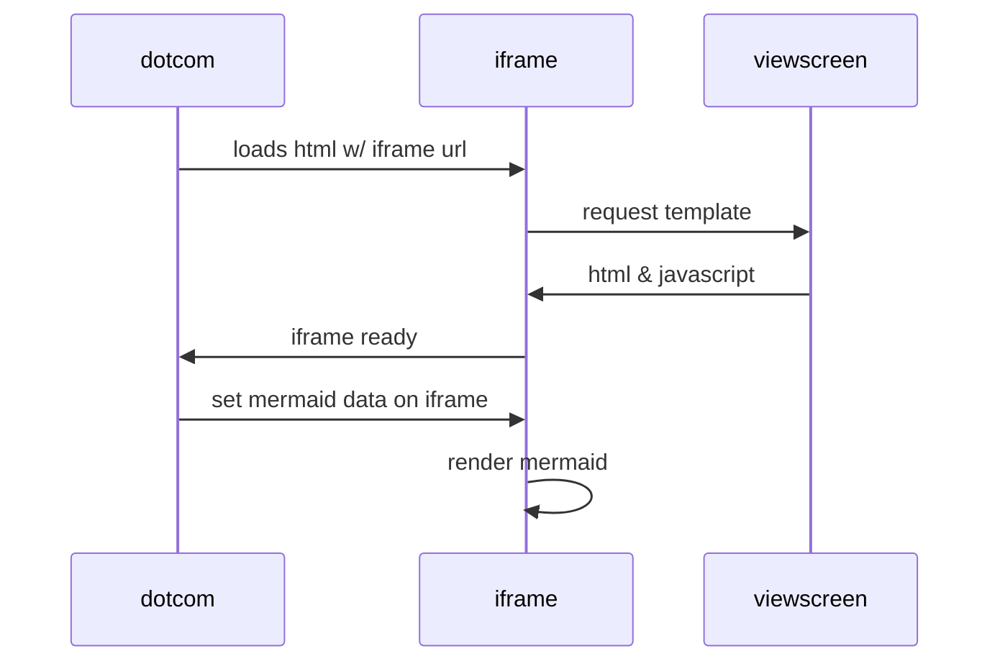

# Predlog izvedbe oddaje elektronske vloge

Dokument je predlog izvedbe postopka oddaje elektronske vloge na sodišče.  


## Akterji

- **Uporabnik**: Stranka sodišča, ki želi oddati elektronsko vlogo
- **Uporabniški agent** (V nadaljevanju: UA): Applikacija/Sistem sestavljen iz komponent programske in/ali strojne opreme, s pomočjo katerih uporabnik pripravi vlogo in prične postopek oddaje elektronske vloge na sodišče. Uporabniški agent je lahko:
  - **Ponudnik storitve elektronskega vlaganja**: komercialni ponudniki sistema za e-vlaganje tržijo spletne storitve za izdelavo in urejanje eVlog, vlaganje ter sledenje statusa vlog na sodišču.; 
  - **Lastna rešitev**: sodišč lahko kupi ali izdela lastni sistem za e-vlaganje, kot je na primer portal za eVlaganje; 
  - **Rešitev „po meri“**: stranke sodišča nadgradijo lastne zaledne informacijske sisteme za sestavljanje in vlaganje eVlog na sodišče. 
- **eOdložišče**: Odložišče e-sodstvo so spletne storitve informacijskega sistema e-sodstvo, ki omogočajo vlaganje vlog v civilnih sodnih postopkih in kazenskem postopku.
- **eVpisnik**: Sistem/modul za podporo vodenja elektronskega spisa v posamezni vrsti sodnega postopka.
- **Ponudnik storitve časovnega žiga**: Izdajatelj kvalificiranih elektronskih časovnih žigov. Uporabniški agent in eOdložišče lahko uporabljata različne ponudnike izdajateljev kvalificiranih elektronskih časovnih žigov.

## Postopek odddaje

- **Korak 1**: Uporabnik s pomočjo "uporabniškega agenta" sestavi eVlogo.
- **Koraki 2-6**: Uporabniški agent (na zahtevo uporabnika) sestavi "XML strukturo" časovnega žiga in ga žigosa z uporabo storitve Izdajatelja kvalificiranih elektronskih časovnih žigov. Korak ni obvezen v primeru, da je "uporabniški agent" lastna rešitev za elektronsko vlaganje. V primeru izdelave časovnega žiga mora biti elekronska vloga oddana na sodišče najkasneje naslednji delovni dan. Vloga se šteje za oddano na sodišče z datumom časovnega žiga. Zato je smotrna izdelava časovne žiga tudi za lastne rešitve, kadar uporabnik želi oddati vlogo izven delovnega časa sodišča, in ko storitve sodišča zaradi vzdrževanja niso dosegljive.
- **Koraka 7-8**: Uporabniški agent (na zahtevo uporabnika) odda pripravljeno vlogo na sodišče.
- **Koraka 8-9**: eOdložišče preveri obstoj časovnega žiga in izvede *1.kontrolo podatkov*. *1.kontrola podatkov* ne sme biti časovno zahteva in vsebuje kontrolo tipov dokumentov, veljavnost po shemi, obstoj zahtevanih podatkov...
- **Koraki 11-13**: v primeru tehnično ustrezne vloge (1. Kontrola) z manjkajočim časovnim žigom, eOdložišče izdela časovni žig.
- **Koraka 14-15**: Če je vloga ustrezna, eOdložišče v odgovoru "Uporabniškemu agentu" vrne status "Sprejem vloge v teku", sicer vrne tehnično napako pri sprejemu in postpke oddaje za vlogo se zaključi.
- **Korak 17**: eOdložišče izvede dodatne kontrole podatkov *2.kontrola podatkov*, ki so časovno zahtevne npr: potrebujejo dostope do izvornih evidenc DIES  (kontrola plačila takse)?
- **Korak 18-21**: V primeru uspešne *2. kontrole podatkov* eVpisnik prevzame vlogo in UE sprejme status o uspešno oddani vlogi. Sicer se vloga "zavrže".

<!-- generated by mermaid compile action - START -->

<details>
  <summary>Mermaid markup</summary>

  ```mermaid
  sequenceDiagram
    autonumber
    actor VLG as Vlagatelj
    participant UA as Uporabniski Agent
    participant CS as Ponudnik storitve<br/>časovnega žiga
    participant ODL as eOdložišče    
    participant VPN as Vpisnik
    
    VLG->>UA: Pripravi e-vlogo
    rect rgb(245, 245, 255)
        opt Časovno žigosanje
            VLG->>UA: Časovno žigosanje
            activate UA
            UA->>UA: Sestavi časovni žig        
            UA->>CS: 
            activate CS
            CS-->>UA: Časovni žig
            deactivate CS
            UA-->>VLG: 
            deactivate UA
        end
    end
    VLG->>UA: Oddaj e-Vlogo
    activate UA    
    UA->>ODL: Oddaja vloge
    deactivate UA
    activate ODL
    ODL->>ODL: Kontrola časovnega žiga!
    ODL->>ODL: 1. Kontrola podatkov!
    rect rgb(245, 245, 255)
        opt Časovno žigosanje
            ODL->>ODL: Sestavi časovni žig        
            ODL->>CS: 
            activate CS
            CS-->>ODL: Časovni žig
            deactivate CS
        end
    end
    alt 
        ODL-->>UA: Sprejem eVloge je teku    
    else 
        rect rgb(255, 230, 230)
            ODL-->>UA: Napaka pri sprejemu vloge    
        end
    end
    deactivate ODL
    UA-->>VLG: Status vloge
    activate ODL
        ODL->>ODL: 2. Kontrola podatkov!
    
    alt Nepopolna vloga
        rect rgb(255, 230, 230)
            ODL->>UA: Vloga je nepopolna!
        end    
    else Vloga je sprejeta
        ODL->>UA: Vloga je sprejeta!
        
    end
    deactivate ODL
    UA-->>VLG: Status vloge
    ODL-->>VPN: Prevzem vloge na vpisnik
```

</details>
<!-- generated by mermaid compile action - END -->

Second ghraph




# Pošiljka elektronske vloge in časovni žig

Namen poglavja je predstaviti možnosti tehnične oblike "Pošiljke elektronske vloge in izvedbe časovnega žiga".

## Vsebina pošiljke elektronske vloge


Pošiljka elektronske vloge je določena v [Pravilnik o elektronskem poslovanju v civilnih sodnih postopkih in v kazenskem postopku](http://www.pisrs.si/Pis.web/pregledPredpisa?id=PRAV13993) in vsebuje več elektronskih dokumentov:  

- Elektronska vloga je elektronski dokument z vsebino vloge stranke in drugih udeležencev v civilnem sodnem postopku ali v kazenskem postopku, ki je sestavljena iz standardiziranega dela besedila vloge v strojno berljivi obliki in nestandardiziranega dela besedila (pisni dokument)

- Elektronska priloga je v elektronsko obliko pretvorjena pisna listina ali dokument, ki je izvorno nastal v elektronski obliki, ki se priloži elektronski vlogi,


## Časovni žig
Časovni žig je določen v [Zakon o elektronskem poslovanju in elektronskem podpisu (uradno prečiščeno besedilo) (ZEPEP-UPB1)](https://www.uradni-list.si/glasilo-uradni-list-rs/vsebina/2004-01-4284?sop=2004-01-4284)
Časovni žig je elektronsko podpisano potrdilo overitelja, ki potrjuje vsebino podatkov, na katere se nanaša, v navedenem času; varni časovni žig pa elektronsko podpisano potrdilo overitelja, ki izpolnjuje pogoje iz prejšnje točke; 

Bolj tehnični opis:
(Kvalificirani) časovni žig je tehnična izvedba potrdila, ki služi kot dokaz, da je bil elektronski dokument ali skupina dokumentov ustvarjena pred določenim datumom in od takrat ni bila spremenjena. V primeru elektronskega vlaganje se lahko ustrezen časovnih žig uporabi kot potrdilo o času odpreme pošiljke na sodišče.


## Predlogi tehnične oblike pošiljke elektronske vloge ter izvedbe časovnega žiga


### Časovni žig kot dopolnilo ebMS 3.0 ovojnice

Elektronska oddaja vloge na sodišče temelji na [OASIS ebMS 3.0 standardu](http://docs.oasis-open.org/ebxml-msg/ebms/v3.0/core/ebms_core-3.0-spec.html) za varno in zanesljivo izmenjavo elektronskih sporočil. Tehnična oblika sporočila je t. im. SOAP s priponkami, kjer je prva priponka elekronsko podpisana SOAP ovojnica z vsemi metapodatki o pošiljki. 
Prvi predlog je časovni žig SOAP ovojnice.

**Prednosti**
- XML struktura je že določena in vsebuje vse metapodatke o pošiljki.

**Slabosti**
- Obstoječe aplikacije (primer: Domibus) praviloma ne omogočajo enostavne implementacije časovnega žiga na ovojnico pred pošiljanjem.


### Časovni žig kot NonRepudiationInformation po vzoru AS4 potrdila

Predlog temelji na izdelavi strukture metapodatkov za časovno žigosanje po vzoru [AS4Reciept](https://docs.oasis-open.org/ebxml-msg/ebms/v3.0/profiles/AS4-profile/v1.0/cos01/examples/as4receipt/UserMessage_No_MPC_P2P_WSSecurity.as4receipt.xml). 
AS4Reciept pri elektronski izmenjavi ebMS 3.0 sporočil služi kot potrdilo o dostavi pošiljke. Sestavni del AS4Reciept je 
"NonRepudiationInformation" struktura podatkov, ki vsebuje zgostitvene vrednosti vseh poslanih dokumentov v sporočilu.   

Za izdelavo dokumenta časovnega žiga, sodišče določi XML strukturo podatkov, ki bi vsebovala NonRepudiationInformation iz poslanega sporočila.


**Prednost in hkrati tudi slabost**
- Sodišče določi XML strukturo podatkov po meri.


### Časovni žig ASiC 
Sodišče določi, da mora biti *pošiljka elektronska vloge* v obliki [ASiC](https://www.etsi.org/deliver/etsi_en/319100_319199/31916201/01.01.01_60/en_31916201v010101p.pdf). ASiC je "ZIP" datoteka, ki vsebuje vse dokumente pošiljke. Dodatno ASiC določa kako morajo biti datoteke podpisane in časovno žigosane.

**Prednosti**
- Uporablja [ecodex](https://www.e-codex.eu/technical-overview) pri *backend integracijah*.
- Primer elektronskega podpisa in žiga je že implementiran v [DSS - eSignature](https://ec.europa.eu/cefdigital/DSS/webapp-demo/doc/dss-documentation.html#_asic_signature_containers)
- Omogoča dolgoročno hrambo pošiljk. 
- Razširjena uporaba v nekaterih evropskih državah.
- Časovni žig pošiljke elektronske vloge ni vezan na transporti protokol ebMS 3.0 in omogoča uporabo drugih standardov za oddajo pošiljke na sodišče.

**Slabosti**
- Za dostop do dokumentov je potrebno "odzipati" pošiljko, kar lahko predstavlja daljši čas pri izvedbi *1. kontrole podatkov* (Opis zgoraj).


